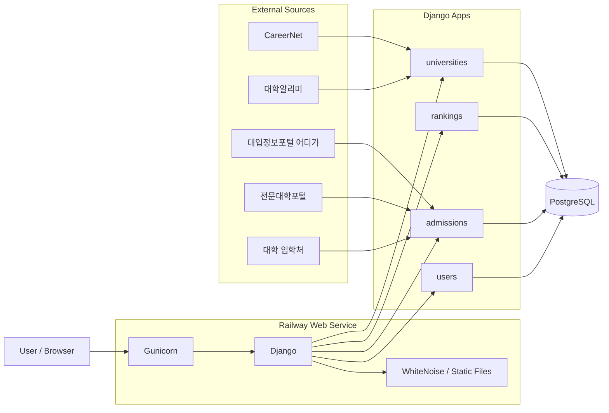
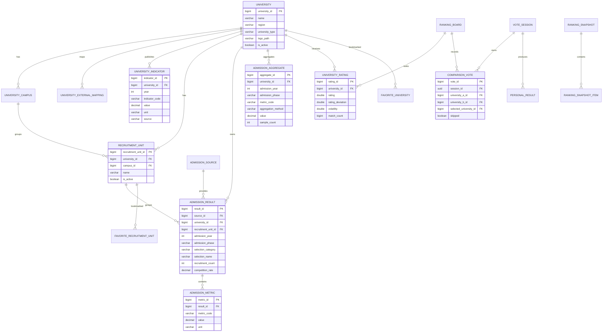

<div align="center">


# 🎓 K-unirank

### 대학 입결 · 사용자 선호도 · 공식 공시 지표를 한곳에서

**공개 입시 데이터와 대학 공시 정보를 구조화하고,**  
**사용자의 실제 VS 선택을 반영한 대학 선호도 랭킹을 제공하는 대학 정보 서비스입니다.**

[](https://k-unirank.com)
[](https://www.python.org/)
[](https://www.djangoproject.com/)
[](https://www.postgresql.org/)
[](https://www.docker.com/)
[](https://railway.com/)

</div>

---

## 🚀 서비스 개요

**K-unirank**는 대학을 하나의 고정 서열로만 보여주지 않습니다.

사용자가 두 대학 중 더 선호하는 곳을 직접 선택하는 **VS 방식의 참여형 선호도 랭킹**, 대입정보포털·전문대학포털·대학 입학처에서 공개된 **대학·학과별 입시 결과**, 대학알리미에서 공개된 **취업·등록금·장학금·교육환경 공식 지표**를 하나의 서비스에서 탐색할 수 있도록 구성했습니다.

> 대학 선호도 랭킹은 사용자 선택을 기반으로 한 참고 지표이며 공식 대학평가가 아닙니다.  
> 입시 결과와 대학 공시 지표는 가능한 한 원문 출처를 함께 제공하며, 실제 지원 판단 시에는 대학 입학처 등 공식 자료를 최종 확인하는 것을 권장합니다.

### 🔗 주요 페이지

| 서비스 | URL |
| --- | --- |
| 입결 찾기 | [k-unirank.com](https://k-unirank.com/) |
| 대학 VS | [k-unirank.com/vs/](https://k-unirank.com/vs/) |
| 통합 순위 허브 | [k-unirank.com/rankings/](https://k-unirank.com/rankings/) |
| 대학 선호도 순위 | [k-unirank.com/ranking/](https://k-unirank.com/ranking/) |
| 입결 순위 | [k-unirank.com/admissions/ranking/](https://k-unirank.com/admissions/ranking/) |
| 대학 찾기 | [k-unirank.com/universities/](https://k-unirank.com/universities/) |
| 공식 공시 순위 예시 | [학생 1인당 장학금 순위](https://k-unirank.com/universities/indicators/scholarship-per-student/) |

---

## ✨ 핵심 기능

### 📊 대학·학과 입결 검색

- 홈에서 입결 검색과 내신 등급 비교로 바로 진입
- 학과 검색 예시, 학년도 선택, JavaScript 없이도 동작하는 전형 필터 링크
- 한글 조합 입력 처리, 검색 기록 뒤로가기, 실패 시 이전 결과 유지 및 재시도
- 모바일에서도 대학·학과 상세 링크와 전문대 평균·최저 지표 제공
- 대학명 / 학과·모집단위 / 전형명 검색
- 학년도 / 수시·정시 필터
- 전형 유형 필터
  - 학생부교과
  - 학생부종합
  - 수능
  - 논술
  - 실기
- 모집인원, 지원인원, 등록인원, 경쟁률 등 공개 항목 저장
- 학생부 등급, 수능 백분위, 대학 환산점수 등 **원문 기준 지표 코드별 저장**
- 대학별 핵심 입결 요약
  - 학생부교과 50% / 70% 컷
  - 학생부종합 50% / 70% 컷
  - 정시 수능 평균 백분위 50% / 70% 컷
- 모집단위별 고유 상세 URL 제공
- 대학별 입시 결과 상세 페이지 제공
- 각 결과의 원문 출처 URL 연결
- `AdmissionSource`에 수집 시각, 문서명, checksum 저장
- 대학 단위 집계를 `AdmissionAggregate`로 분리해 원본 결과와 파생값을 구분

### 🏆 입결 순위

입시 결과 중 서로 비교 가능한 동일 지표를 대학 단위로 집계해 별도의 참고 순위를 제공합니다.

- 4년제 / 전문대 분리
- 수시 / 정시 분리
- 대학명을 검색해도 **전체 순위 기준 원래 순위 번호 유지**
- 원본 모집단위 표본 수 표시
- 가능한 경우 모집인원 가중평균 사용
- 서로 다른 성적 체계나 metric code를 하나의 점수로 임의 통합하지 않음

### 🆚 대학 VS & Glicko-2 선호도 랭킹

현재 사용자 선호도는 `overall` 단일 Board를 중심으로 운영합니다.

- 모든 대학의 초기 상태 동일
  - Rating: `1500`
  - Rating Deviation: `350`
  - Volatility: `0.06`
- 운영자가 지정한 인위적 대학별 seed 점수 없음
- 두 대학 중 선호 대학 선택 또는 **건너뛰기**
- 원본 투표 `ComparisonVote` 보존
- Glicko-2 기반 실시간 Rating 갱신
- 최근 등장 대학·동일 대진에 cooldown을 적용해 반복 노출 완화
- 기본 매칭 비율
  - 약 80%: 비슷한 점수/순위의 close matchup
  - 약 15%: 인접 tier challenge matchup
  - 약 5%: 비교 횟수가 부족한 대학 exploration
- 동일 세션에서 같은 대진 반복 시 Rating 영향도 감소
  - 첫 투표: `100%`
  - 두 번째: `35%`
  - 세 번째부터: `0%`
- 승/패/비교 횟수와 일별 Ranking Snapshot 관리
- 검색 및 최소 비교 횟수 필터 지원

### 🙋 나의 대학 TOP10

사용자의 개인 VS 기록은 전체 선호도 랭킹과 별도로 계산합니다.

- 건너뛰지 않은 개인 투표만 사용
- 개인 결과는 단순 Elo 방식으로 재계산
- 초기 점수 `1500`, `K=32`
- 충분한 비교 이후 개인 TOP10 생성
- `PersonalResult`에 결과 JSON과 생성 시점 저장

### 🏫 대학 정보 & 캠퍼스 정규화

- 대학명 / 지역 기반 검색
- 대학 로고, 주소, 홈페이지, 설립구분 등 기본 정보
- CareerNet 기반 대학·캠퍼스 동기화
- `UniversityCampus`로 실제 캠퍼스 정보 별도 관리
- `UniversityExternalMapping`으로 CareerNet / ADIGA 등 외부 코드 연결
- 주소·지역·교명 정규화
- 분교·이원화 캠퍼스는 서비스 정책에 따라 별도 대학 항목으로 유지
- 실제 대학 자체가 통합된 경우에는 현재 대학으로 병합

### 🏛 대학알리미 공식 지표

`UniversityIndicator` 모델을 통해 대학알리미 등 공식 공시 출처의 연도별 대학 지표를 별도로 저장합니다.

현재 서비스에서 사용하는 핵심 지표는 7개입니다.

| 지표 | 순위 기준 |
| --- | --- |
| 취업률 | 높은 순 |
| 평균 등록금 | 낮은 순 |
| 학생 1인당 장학금 | 높은 순 |
| 기숙사 수용률 | 높은 순 |
| 학생 1인당 교육비 | 높은 순 |
| 전임교원 1인당 학생 수 | 적은 순 |
| 전임교원 확보율 | 높은 순 |

- 대학 상세 페이지에서 최신 공시값 카드 제공
- 지표별 전국 대학 순위 페이지 제공
- 공시연도 / 지역 / 대학명 필터
- 검색·지역 필터 후에도 전체 대학 기준 원래 순위 유지
- 대학알리미 원문 출처 링크 제공
- 금액 지표는 DB에 원 단위로 정규화해 저장

### 🧭 통합 순위 허브

`/rankings/`에서 서로 성격이 다른 순위를 한곳에 모아 제공합니다.

- 사용자 VS 기반 대학 선호도 순위
- 공개 입시 결과 기반 입결 순위
- 대학알리미 공식 지표별 순위

각 순위는 계산 기준과 출처가 다르므로 별도 기준으로 표시합니다.

### ❤️ 회원 기능

- 회원가입 / 로그인
- 관심 대학 저장
- 관심 모집단위 저장
- 마이페이지 관심 목록 관리
- 로그인 상태의 VS 선택 이력 확인
- 최근 VS 기록 미리보기 및 전체 기록 페이지
- 개인 VS 기록 기반 나의 대학 TOP10

### 🔎 SEO · Analytics · 광고

- canonical domain: `https://k-unirank.com`
- `www.k-unirank.com` → apex domain 301 redirect
- GET query가 있는 검색/필터 페이지는 기본 `noindex,follow`
- 대학 / 대학 입시 / 모집단위별 고유 sitemap URL 생성
- `sitemap.xml`, `robots.txt`, `ads.txt` 제공
- Open Graph / Twitter meta tag
- `Organization`, `CollectionPage`, `WebSite` 등 JSON-LD 구조화 데이터
- Google Analytics 4 이벤트 추적
- Google AdSense 수동 디스플레이 광고 및 사이트 광고 스크립트 연동

---

## 🗃 데이터 출처

| 출처 | 사용 목적 |
| --- | --- |
| CareerNet | 대학 기본 정보, 캠퍼스, 주소, 홈페이지, 외부 코드 정리 |
| 대입정보포털 어디가 (ADIGA) | 4년제 대학 수시·정시 모집단위별 입시 결과 |
| 전문대학포털 (Procollege) | 전문대학 모집단위별 입시 결과 |
| 각 대학 입학처 | 대학이 직접 공개한 공식 입시 결과 보강 |
| 대학알리미 | 취업률, 등록금, 장학금, 교육비, 교원, 기숙사 등 공식 공시 지표 |

입시 출처는 `AdmissionSource`, 외부 대학 코드는 `UniversityExternalMapping`, 대학 공시값은 `UniversityIndicator`로 분리해 관리합니다.

---

## 🛠 기술 스택

### Backend

|  |  |  |
| :---: | :---: | :---: |
| Python 3.12 | Django 5.2 | PostgreSQL |

### Data Collection & Processing

<p>
  
  
  
  
</p>

### Frontend

|  |  |  |
| :---: | :---: | :---: |
| Django Templates / HTML | CSS | Vanilla JavaScript |

### Deployment

|  |  |  |
| :---: | :---: | :---: |
| Docker | Gunicorn + WhiteNoise | Railway |

Docker Web 이미지는 `python:3.12-slim`을 사용하고, 컨테이너 시작 시 `migrate → collectstatic → gunicorn` 순서로 실행합니다.

---

## 🏗 시스템 아키텍처



---

## 🗂 핵심 데이터 구조



> 위 ERD는 README 가독성을 위한 핵심 관계 요약입니다. 실제 모델에는 외부 매핑, 랭킹 스냅샷, 개인 결과, 관심 데이터 등 추가 필드와 제약조건이 존재합니다.

---

## 📁 프로젝트 구조

```text
K-unirank_v2/
├── config/          # Django settings, URL, middleware, sitemap, WSGI
├── universities/    # 대학·캠퍼스·외부 매핑·대학알리미 공식 지표
├── rankings/        # VS, Glicko-2, 선호도 순위, Snapshot, 개인 TOP10
├── admissions/      # 입시 원본·지표·집계·검색·크롤러
├── users/           # 회원, 관심 대학/모집단위, 마이페이지
├── templates/       # Django Templates
├── static/          # CSS, JavaScript, 대학 로고 등 정적 파일
├── Dockerfile
├── docker-compose.yml
├── requirements.txt
└── manage.py
```

---

## ⚙️ 로컬 실행

### 1. 저장소 Clone

```bash
git clone https://github.com/dh1180/K-unirank_v2.git
cd K-unirank_v2
```

### 2. 가상환경 및 의존성 설치

```bash
python -m venv .venv
```

macOS / Linux:

```bash
source .venv/bin/activate
pip install -r requirements.txt
```

Windows PowerShell:

```powershell
.\.venv\Scripts\Activate.ps1
pip install -r requirements.txt
```

### 3. 환경변수 설정

프로젝트 루트에 `.env` 파일을 생성합니다.

```env
DJANGO_SECRET_KEY=local-secret-key
DJANGO_DEBUG=True
DJANGO_ALLOWED_HOSTS=127.0.0.1,localhost
CSRF_TRUSTED_ORIGINS=

DB_NAME=kunirank
DB_USER=kunirank
DB_PASSWORD=your_password
DB_HOST=127.0.0.1
DB_PORT=5433

CAREER_API_KEY=your_api_key

# 선택 사항
GA_ENABLED=False
GA_MEASUREMENT_ID=G-XXXXXXXXXX
```

`docker-compose.yml`은 로컬 PostgreSQL의 `5432`를 호스트 `127.0.0.1:5433`에 연결합니다.

### 4. PostgreSQL 실행

```bash
docker compose up -d
```

### 5. DB 초기화

```bash
python manage.py migrate
python manage.py init_kunirank
```

관리자 계정이 필요하면:

```bash
python manage.py createsuperuser
```

### 6. 개발 서버 실행

```bash
python manage.py runserver
```

```text
Home          http://127.0.0.1:8000/
VS            http://127.0.0.1:8000/vs/
Rankings Hub  http://127.0.0.1:8000/rankings/
Ranking       http://127.0.0.1:8000/ranking/
Universities  http://127.0.0.1:8000/universities/
Admin         http://127.0.0.1:8000/admin/
Health        http://127.0.0.1:8000/health/
```

### 7. 입결 탐색 회귀 테스트

```bash
python manage.py test admissions.test_discovery
npm ci --prefix tests/frontend
npm test --prefix tests/frontend
```

프런트엔드 테스트는 Node.js 18 이상에서 실행합니다. DOM 환경에서 연속 검색의 응답 순서, 한글 조합 입력, 뒤로가기, 재시도와 모바일 링크·지표 표시를 검증합니다. 실제 브라우저의 레이아웃 검증은 별도로 진행해야 합니다.

점수 비교 테스트는 공식 출처 선택 후 범위 필터 적용, 비정상 등급 입력 처리, 50%·70% 컷 평균 분리를 확인합니다. 전체 테스트는 `python manage.py test`로 실행할 수 있습니다.

---

## 📥 데이터 동기화 & 감사

대부분의 수집 명령은 **기본적으로 미리보기**이며 `--apply`를 붙일 때 DB에 반영합니다.

### CareerNet 대학 데이터

미리보기:

```bash
python manage.py sync_career_universities
```

실제 반영:

```bash
python manage.py sync_career_universities --apply --create-new
```

대학명·주소·캠퍼스 정규화:

```bash
python manage.py normalize_university_data --apply
```

### ADIGA 4년제 입시 데이터

특정 대학 확인:

```bash
python manage.py sync_adiga_admissions --university 단국대학교 --limit 2
```

저장:

```bash
python manage.py sync_adiga_admissions --university 단국대학교 --limit 2 --apply
```

수집 데이터 감사:

```bash
python manage.py audit_adiga_import
```

### 전문대학포털 입시 데이터

특정 대학 미리보기:

```bash
python manage.py sync_procollege_admissions --year 2026 --university 인하공업전문대학
```

해당 학년도 전체 저장:

```bash
python manage.py sync_procollege_admissions --year 2026 --all --apply
```

### 전체 기본 파이프라인

CareerNet → 대학 정규화 → ADIGA 순서로 실행:

```bash
python manage.py sync_kunirank_data
```

### 입시 대학 단위 집계 재계산

```bash
python manage.py recalculate_admission_aggregates --year 2026
```

### 대학알리미 공식 지표

대학알리미에서 내려받은 `대학주요정보 한눈에 보기` XLSX 미리보기:

```bash
python manage.py import_academyinfo_snapshot ./academyinfo.xlsx
```

실제 반영:

```bash
python manage.py import_academyinfo_snapshot ./academyinfo.xlsx --apply
```

공시연도를 강제로 지정해야 할 경우:

```bash
python manage.py import_academyinfo_snapshot ./academyinfo.xlsx --year 2026 --apply
```

---

## 📈 랭킹 운영

오늘의 랭킹 Snapshot 생성:

```bash
python manage.py create_ranking_snapshot
```

원본 투표를 기준으로 전체 Rating 재계산:

```bash
python manage.py rebuild_ratings
```

종합 Board만 재계산:

```bash
python manage.py rebuild_ratings --board overall
```

---

## 🔌 Ranking API

```http
GET  /api/v1/boards/overall/next/
POST /api/v1/boards/overall/vote/
GET  /api/v1/boards/overall/ranking/?limit=50
```

투표 요청 예시:

```json
{
  "university_a": 1,
  "university_b": 2,
  "selected_university": 1,
  "skipped": false
}
```

---

## 📌 대학·캠퍼스 통합 기준

K-unirank는 외부 사이트의 대학명을 그대로 사용하는 대신, CareerNet·ADIGA·대학알리미의 서로 다른 표기를 내부 `University` 기준으로 정규화합니다.

### 별도 대학 항목으로 유지하는 대표 사례

- 건국대학교 / 건국대학교 글로컬캠퍼스
- 고려대학교 / 고려대학교 세종캠퍼스
- 연세대학교 / 연세대학교 미래캠퍼스
- 한양대학교 / 한양대학교 ERICA캠퍼스
- 동국대학교 / 동국대학교 WISE캠퍼스
- 단국대학교 죽전캠퍼스 / 단국대학교 천안캠퍼스
- 상명대학교 / 상명대학교 천안캠퍼스
- 홍익대학교 / 홍익대학교 세종캠퍼스

### 하나의 대학 단위로 접어 관리하는 사례

- 가톨릭대학교
- 한국폴리텍대학

이 경우에도 개별 캠퍼스 정보 자체는 `UniversityCampus`에 유지할 수 있습니다.

### 실제 학교 통합에 따른 현재 교명 정리 사례

- 강릉원주대학교 계열 → 강원대학교
- 안동대학교·경북도립대학교 계열 → 국립경국대학교
- 경남도립거창대학·경남도립남해대학 계열 → 국립창원대학교

캠퍼스 분리·통합 여부는 입시 결과와 외부 코드가 잘못 섞이지 않도록 명시적인 alias / 주소 / source code 규칙으로 관리합니다.

---

## 🚢 Deployment

서비스는 **Railway Web Service + Railway PostgreSQL** 환경에서 운영합니다.

Docker Container 시작 시:

```text
python manage.py migrate
        ↓
python manage.py collectstatic --noinput
        ↓
gunicorn config.wsgi:application --bind 0.0.0.0:8000 --workers 2 --timeout 60
```

주요 배포 환경변수:

```text
DATABASE_URL
DJANGO_SECRET_KEY
DJANGO_ALLOWED_HOSTS
CSRF_TRUSTED_ORIGINS
GA_ENABLED
GA_MEASUREMENT_ID
GA_ALLOWED_HOSTS
```

Static files는 WhiteNoise의 `CompressedManifestStaticFilesStorage`를 사용합니다.

---

## ⚠️ 데이터 원칙

K-unirank는 서로 다른 출처와 서로 다른 산식의 지표를 하나의 공식 대학 점수처럼 강제로 합치지 않는 것을 기본 원칙으로 합니다.

- 원본 입시 결과와 대학 단위 파생 집계 분리
- 원문 URL 및 출처 유형 저장
- 외부 대학 코드와 내부 대학 ID 분리
- 대학알리미 공식 지표와 사용자 선호도 랭킹 분리
- 사용자 투표 원본과 파생 Rating 분리
- 공개 형식이 다른 입시 지표는 metric code별로 보존

서비스의 순위는 각각의 기준에 따른 **비교·탐색용 참고 정보**입니다.

---

## 👨‍💻 Maintainer

<div align="center">

[](https://github.com/dh1180)

**K-unirank**  
대학을 탐색하고, 입결을 비교하고, 사용자 선택과 공식 데이터를 함께 살펴보는 서비스

</div>
