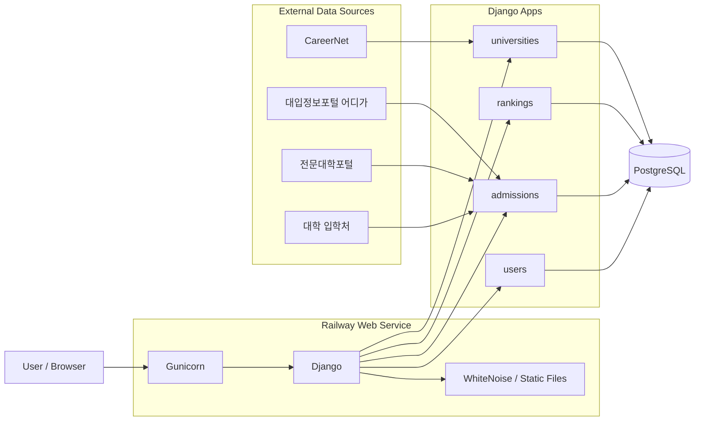
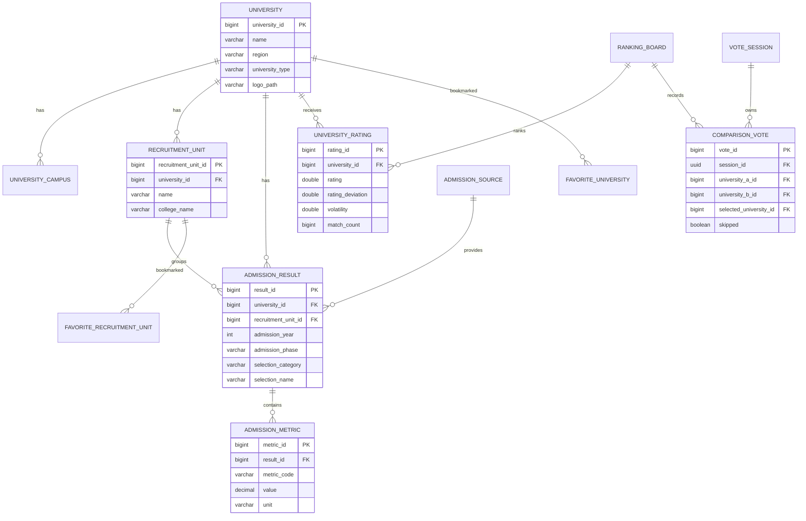

<div align="center">


# 🎓 K-unirank

### 대학 입결 · 대학 선호도 랭킹 · 학과별 입시 결과를 한곳에서

**사용자의 실제 VS 선택으로 만들어지는 대학 선호도 랭킹과**  
**공개 입시 데이터를 기반으로 한 대학·학과별 입결 탐색 서비스를 제공합니다.**

[](https://k-unirank.com)
[](https://www.python.org/)
[](https://www.djangoproject.com/)
[](https://www.postgresql.org/)
[](https://www.docker.com/)
[](https://railway.com/)

</div>

---

## 🚀 서비스 개요

**K-unirank**는 대학을 단순한 고정 순위로 보여주는 대신, 사용자가 직접 두 대학 중 더 선호하는 대학을 선택하는 **VS 방식의 참여형 대학 랭킹 서비스**입니다.

동시에 대입정보포털·전문대학포털·대학 입학처 등에서 공개된 입시 결과를 구조화하여 **대학별·학과별 수시/정시 입결, 경쟁률, 50%·70% 컷 등의 지표를 검색하고 비교**할 수 있습니다.

> 대학 선호도 랭킹은 사용자 투표를 기반으로 한 참고 지표이며 공식 대학평가가 아닙니다.  
> 입시 데이터 역시 실제 지원 판단 시 각 대학의 공식 입학처 자료와 함께 확인하는 것을 권장합니다.

### 🔗 바로가기

| 서비스 | URL |
| --- | --- |
| 입결 찾기 | [k-unirank.com](https://k-unirank.com/) |
| 대학 VS | [k-unirank.com/vs/](https://k-unirank.com/vs/) |
| 대학 선호도 랭킹 | [k-unirank.com/ranking/](https://k-unirank.com/ranking/) |
| 대학 찾기 | [k-unirank.com/universities/](https://k-unirank.com/universities/) |
| 입결 순위 | [k-unirank.com/admissions/ranking/](https://k-unirank.com/admissions/ranking/) |

---

## ✨ 핵심 기능

### 🆚 대학 VS & Glicko-2 랭킹

- 두 대학을 랜덤/조건 기반으로 매칭하여 선호 대학 선택
- 잘 모르겠는 대결은 **건너뛰기** 가능
- 원본 투표 기록(`ComparisonVote`)을 보존하고 파생 랭킹 점수 계산
- 모든 대학은 동일한 초기 점수에서 시작
- **Glicko-2** 기반 `rating / rating_deviation / volatility` 관리
- 같은 세션에서 동일 대진이 반복될 경우 랭킹 영향력을 단계적으로 감소
- 일별 Ranking Snapshot을 이용한 순위 등락 관리

### 📊 대학·학과 입결 검색

- 대학명 / 학과·모집단위 / 전형명 검색
- 수시·정시 필터
- 전형 유형별 필터
  - 학생부교과
  - 학생부종합
  - 수능
  - 논술
  - 실기
- 모집인원, 경쟁률, 학생부 등급, 수능 백분위 등 공개 지표 제공
- 대학별 **핵심 입결 요약** 제공
  - 학생부교과 50% / 70% 컷
  - 학생부종합 50% / 70% 컷
  - 정시 수능 평균 백분위 50% / 70% 컷
- 학과·모집단위별 독립 입결 상세 페이지 제공
- 각 결과에 공식 원문 출처 URL 연결

### 🏫 대학 정보

- 대학명 / 지역 기반 대학 검색
- 대학 로고 및 캠퍼스 정보
- 사용자 선호도 랭킹 점수와 실제 비교 횟수
- 대학별 최신 핵심 입시 지표
- CareerNet 기반 대학 정보 동기화
- 이원화 캠퍼스·분교는 실제 대학 단위에 맞춰 독립 관리

### ❤️ 회원 기능

- 회원가입 / 로그인
- 관심 대학 저장
- 관심 학과·모집단위 저장
- 마이페이지에서 관심 목록 관리
- 로그인 상태의 VS 선택 이력 저장
- 마이페이지에서는 최근 VS 4건 미리보기
- 별도 페이지에서 전체 VS 기록 확인
- 개인 선택 기록 기반 **나의 대학 TOP10** 생성

### 🔎 SEO & 검색 노출

- 대학별 동적 `title` / `description` / canonical URL
- 대학 및 학과 입결 전용 고유 URL
- `CollegeOrUniversity`, `BreadcrumbList` 등 구조화 데이터
- `sitemap.xml`, `robots.txt` 제공
- 검색/필터 Query URL은 중복 색인을 줄이기 위해 `noindex,follow` 처리

---

## 🛠 기술 스택

### Backend

|  |  |  |
| :---: | :---: | :---: |
| Python 3.12 | Django 5.2 | PostgreSQL |

### Data Collection & Processing

<p>
  
  
  
</p>

### Frontend

|  |  |  |
| :---: | :---: | :---: |
| HTML | CSS | JavaScript |

### Deployment

|  |  |  |
| :---: | :---: | :---: |
| Docker | Gunicorn + WhiteNoise | Railway |

실행 환경은 Python 3.12 기반 Docker 이미지이며, 배포 시 `migrate → collectstatic → gunicorn` 순서로 애플리케이션을 시작합니다. 현재 Python/Django/PostgreSQL 및 배포 의존성은 `requirements.txt`와 `Dockerfile`에서 관리합니다.

---

## 🏗 시스템 아키텍처



---

## 🗂 핵심 데이터 구조



> 위 ERD는 README 가독성을 위한 핵심 관계 요약입니다. 실제 모델에는 출처 매핑, 랭킹 스냅샷, 개인 결과, 집계 테이블 등의 추가 엔터티가 존재합니다.

---

## 📁 프로젝트 구조

```text
K-unirank_v2/
├── config/          # Django 설정, URL, sitemap, WSGI
├── universities/    # 대학·캠퍼스·외부 매핑 및 대학 정보
├── rankings/        # VS, Glicko-2, 랭킹, 스냅샷, 개인 TOP10
├── admissions/      # 입시 결과·지표·집계·데이터 수집/검색
├── users/           # 회원, 관심 대학/학과, 마이페이지, VS 이력
├── templates/       # Django Templates
├── static/          # CSS, JavaScript, 대학 로고 등 정적 파일
├── Dockerfile
├── docker-compose.yml
├── requirements.txt
└── manage.py
```

---

## ⚙️ 로컬 실행

### 1. 저장소 Clone

```bash
git clone https://github.com/dh1180/K-unirank_v2.git
cd K-unirank_v2
```

### 2. 가상환경 및 패키지 설치

```bash
python -m venv .venv
```

macOS / Linux:

```bash
source .venv/bin/activate
pip install -r requirements.txt
```

Windows PowerShell:

```powershell
.\.venv\Scripts\Activate.ps1
pip install -r requirements.txt
```

### 3. 환경변수 설정

프로젝트 루트에 `.env` 파일을 생성합니다.

```env
DJANGO_SECRET_KEY=local-secret-key
DJANGO_DEBUG=True
DJANGO_ALLOWED_HOSTS=127.0.0.1,localhost

DB_NAME=kunirank
DB_USER=kunirank
DB_PASSWORD=your_password
DB_HOST=127.0.0.1
DB_PORT=5432

CAREER_API_KEY=your_api_key
```

### 4. PostgreSQL 실행

```bash
docker compose up -d
```

### 5. DB 초기화

```bash
python manage.py migrate
python manage.py init_kunirank
```

관리자 계정이 필요하면:

```bash
python manage.py createsuperuser
```

### 6. 개발 서버 실행

```bash
python manage.py runserver
```

```text
Home     http://127.0.0.1:8000/
VS       http://127.0.0.1:8000/vs/
Ranking  http://127.0.0.1:8000/ranking/
Admin    http://127.0.0.1:8000/admin/
Health   http://127.0.0.1:8000/health/
```

---

## 📥 데이터 동기화

### 대학 데이터

CareerNet 데이터 미리보기:

```bash
python manage.py sync_career_universities
```

반영:

```bash
python manage.py sync_career_universities --apply --create-new
```

대학명·주소·캠퍼스 정규화:

```bash
python manage.py normalize_university_data --apply
```

### 입시 데이터

ADIGA 특정 대학 파싱 확인:

```bash
python manage.py sync_adiga_admissions --university 단국대학교 --limit 2
```

실제 저장:

```bash
python manage.py sync_adiga_admissions --university 단국대학교 --limit 2 --apply
```

전체 데이터 파이프라인:

```bash
python manage.py sync_kunirank_data
```

입시 데이터 집계 재계산:

```bash
python manage.py recalculate_admission_aggregates --year 2026
```

> 대학마다 입시 지표의 공개 방식이 다르므로 서로 다른 기준을 하나의 공식 점수처럼 강제로 합치지 않습니다. 대학 단위 파생값은 가능한 경우 모집인원 가중평균을 사용합니다.

---

## 📈 랭킹 운영

오늘의 랭킹 스냅샷 생성:

```bash
python manage.py create_ranking_snapshot
```

원본 투표를 기준으로 전체 Rating 재계산:

```bash
python manage.py rebuild_ratings
```

특정 Board만 재계산:

```bash
python manage.py rebuild_ratings --board overall
```

---

## 🔌 API

```http
GET  /api/v1/boards/overall/next/
POST /api/v1/boards/overall/vote/
GET  /api/v1/boards/overall/ranking/?limit=50
```

투표 요청 예시:

```json
{
  "university_a": 1,
  "university_b": 2,
  "selected_university": 1,
  "skipped": false
}
```

---

## 📌 대학 통합 기준

K-unirank는 **실제로 대학 자체가 통합된 경우에만 하나의 대학으로 통합**합니다.

이원화 캠퍼스나 분교처럼 독립적인 입시·운영 단위를 가지는 경우 각각 별도의 대학 항목으로 유지합니다.

예시:

- 단국대학교 죽전캠퍼스 / 천안캠퍼스 → 분리
- 고려대학교 / 고려대학교 세종캠퍼스 → 분리
- 연세대학교 / 연세대학교 미래캠퍼스 → 분리
- 한양대학교 / 한양대학교 ERICA캠퍼스 → 분리
- 동국대학교 / 동국대학교 WISE캠퍼스 → 분리
- 한국폴리텍대학 각 캠퍼스 → 분리
- 실제 학교 자체가 통합된 대학 → 통합

---

## 🚢 Deployment

서비스는 **Railway + PostgreSQL** 환경에서 운영합니다.

Docker Container 시작 시 다음 과정이 자동으로 실행됩니다.

```text
python manage.py migrate
        ↓
python manage.py collectstatic --noinput
        ↓
gunicorn config.wsgi:application
```

주요 배포 환경변수:

```text
DATABASE_URL
DJANGO_SECRET_KEY
DJANGO_ALLOWED_HOSTS
CSRF_TRUSTED_ORIGINS
GA_MEASUREMENT_ID
```

---

## 👨‍💻 Maintainer

<div align="center">

[](https://github.com/dh1180)

**K-unirank**  
대학을 탐색하고, 비교하고, 직접 순위를 만들어가는 서비스

</div>
